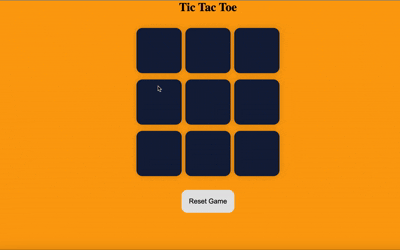

# Tic-Tac-Toe-Game

This is a Tic-Tac-Toe game that I created to learn how to manipulate HTML elements using JavaScript

The project uses:
- **HTML** for structure
- **Vanilla CSS** for styling
- **Vanilla JavaScript**, for basic DOM manipulation

It helped me understand how to build responsive front-end applications using JavaScript.

## Features

- **Created a Board like structure**
The board has 9 boxes and 2 players can play at a time.The player can choose between O's and X's. if one opts for O's then the other person will automatically get X's.Players can play alternatviely. Once we get a pattern of X's or O's that resembles the winning pattern then we can declare that player the winner else it will draw the game.

- **Option to reset the game**
The players can reset the game whenever they wish to.

-**Option to start a new game after the previous game ends** 

-**Clean & Responsive UI**  
Built with HTML, CSS, and vanilla JS for a simple yet responsive front-end
## Demo
